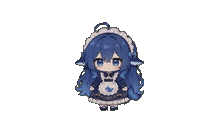

<div align="center">

# 🐋 better-dsh-pet

**一只住在 Windows 桌面上的大肥鱼，由 DeepSeek Harness 真实工作状态驱动。**

透明 · 置顶 · 会吐槽 · 会番茄钟 · 会喂食 · 会陪你干活

<br/>

[](https://www.npmjs.com/package/better-dsh-pet)
[](https://www.npmjs.com/package/better-dsh-pet)
[](https://github.com/ysppwn721/better-dsh-pet)
[](LICENSE)


</div>

---

## 🎬 视频推广

> 📹 演示视频占位：把视频链接放到这里，例如 B站 / YouTube。
>
> 示例：
> ```md
> [▶️ 点击观看 better-dsh-pet 演示视频](https://www.bilibili.com/video/你的视频ID)
> ```

---

## ✨ 它是什么？

`better-dsh-pet` 是一个 **DSH 桌面宠物插件**：

- 不再只是网页里的小挂件，而是**独立透明置顶窗口**
- 能感知 DSH 的真实工作状态：思考 / 工作 / 等待 / 完成 / 出错
- 状态变化时自动切换动画和气泡文案
- 还内置了余额显示、番茄钟、喂食、吐槽、自定义动作等玩法

## 🚀 一行命令安装

```bash
dsh plugin --profile web add better-dsh-pet
```

重启：

```bash
dsh web
```

然后桌面上就会出现大肥鱼啦～

---

## 🎯 功能亮点

| 功能 | 说明 |
|---|---|
| 🧠 **DSH 状态联动** | 思考、工作、等待、完成、出错自动切换动画和气泡 |
| 🖥️ **独立桌面气泡** | 透明、无边框、始终置顶，不占用网页界面 |
| 🎞️ **91 个透明动画** | 待机、打瞌睡、玩魔方、写代码、吃火锅、放烟花、拆礼物…… |
| 🚶 **屏幕漫游** | 可开关；支持移动频率调节 |
| 🖱️ **点击 / 拖拽** | 点击有回应，可拖到任意位置 |
| 🍚 **喂食互动** | 右键喂食，播放吃饭动画并显示感谢气泡 |
| 💰 **余额显示** | 气泡中显示 DeepSeek 账户余额 |
| 🍅 **番茄钟** | 自定义时长，倒计时气泡，结束提示音 + 抖动 |
| 💬 **对话吐槽** | 根据本次对话生成俏皮吐槽（可开关，会消耗 Token） |
| 🎛️ **自定义动作** | 右键勾选要播放的动作，支持自定义播放顺序 |
| ⚙️ **行为设置** | 大小、移动频率、动作切换间隔、行走开关 |

---

## 📸 效果预览

> 动画为透明背景；GIF 预览中透明部分显示为页面底色，实际播放为透明。

<p align="center">
  
  
  
  
  
  
</p>

<p align="center">
  
  
  
  
  
  
</p>

全部 **91 个透明动画** 见仓库：`assets/thumb/`

---

## ⚙️ 配置

| 配置项 | 说明 | 默认 |
|---|---|---|
| `enabled` | 是否启用大肥鱼 | `true` |
| `petSize` | 宠物宽度（px） | `460` |
| `scale` | 角色大小（70%～140%） | `100%` |
| `bubbleScale` | 气泡大小（80%～120%） | `100%` |
| `walkEnabled` | 是否允许走动 | `true` |
| `moveChance` | 移动频繁度（%） | `20` |
| `actionDelayMs` | 动作切换间隔（ms） | `0` |
| `enabledActions` | 自定义待机动作 | `[]`（全部） |
| `actionOrder` | 自定义播放顺序 | `[]`（随机） |
| `bubbleMode` | 气泡显示模式 | `always` |
| `roastEnabled` | 自动吐槽（耗 Token） | `false` |

---

## 🛠️ 开发 / 构建

```bash
# 本地安装
dsh plugin --profile web add "D:\dsh-pet"

# 打包
npm pack
```

---

## 📌 二创声明

本项目是基于 [PC2005-cloud/dsh-pet](https://github.com/PC2005-cloud/dsh-pet) 的**二创修改版**，感谢原作者的桌宠动画与设计。

---

## 🔎 相关链接

- 社区插件目录：[awesome-dsh-plugin.com](https://awesome-dsh-plugin.com)
- DSH 官方仓库：[deepseek-ai/DeepSeek-Harness](https://github.com/deepseek-ai/deepseek-harness)
- 上游原版：[PC2005-cloud/dsh-pet](https://github.com/PC2005-cloud/dsh-pet)

---

## 📄 许可

- 代码：MIT
- 素材（动画/提示词）：见仓库说明，禁止商用

---

<div align="center">

**如果这个大肥鱼让你开心，给个 ⭐ 支持一下吧～**

</div>
